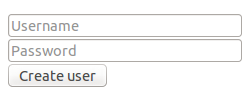

.. ==================================================
.. FOR YOUR INFORMATION
.. --------------------------------------------------
.. -*- coding: utf-8 -*- with BOM.

.. include:: ../Includes.txt

.. _users-manual:

Users manual
============

The user can simply create their forms from the wizard, and then add the 
attributes that are necessary. 

All custom attributes can user stdWrap function.

Example
-------
For example a form with username and password can be constructed as follows:

**Form configuration**
:: 

    prefix = tx_form
    confirmation = 1
    postProcessor {
        1 = mail
        1 {
            recipientEmail = test@exemple.com
            senderEmail = test@exemple.com
        }
    }
    10 = TEXTLINE
    10 {
        data-validation-rule = ^[a-zA-Z][a-zA-Z0-9_-@\.]{4,}$
        name = username
        placeholder = Username
        placeholder{
            lang.fr = Nom d'utilisateur
        }
        autocomplete = off
    }
    20 = PASSWORD
    20 {
        data-validation-rule = ^(?=.*\d)(?=.*[a-z])(?=.*[A-Z])\w{6,}$
        name = password
        placeholder = Password
        placeholder{
            lang.fr = Mot de passe
        }
        autocomplete = off
    }
    30 = SUBMIT
    30 {
        name = create
        value = Create user
        value{
            lang.fr = Créer l'utilisateur
        }
    }
    ...

**Frontend result:**

**Frontend HTML code:**

:: 

    

      <form method="post" enctype="multipart/form-data" action="index.php?id=1">
        <ol>
          <li class="csc-form-2 csc-form-element csc-form-element-textline">
            <input type="text" autocomplete="off" placeholder="Username" data-validation-rule="^[a-zA-Z][a-zA-Z0-9_-@\.]{4,}$" name="tx_form[username]" id="field-2">
          </li>
          <li class="csc-form-3 csc-form-element csc-form-element-password">
            <input type="password" autocomplete="off" placeholder="Password" data-validation-rule="^(?=.*\d)(?=.*[a-z])(?=.*[A-Z])\w{6,}$" name="tx_form[password]" id="field-3">
          </li>
          <li class="csc-form-4 csc-form-element csc-form-element-submit">
            <input type="submit" value="Create user" name="tx_form[create]" id="field-4">
          </li>
        </ol>
      </form>
    

